# Introduction

## NUS Formula SAE Team

The NUS Formula SAE (FSAE) Team is an engineering project under the Engineering Design and Innovation Centre (EDIC) and comprises of Electrical and Mechanical Engineering Students. A total of 27 team members make up the R26E team, consisting of 13 fourth year students and 14 third year students, who will be building the R26E race car.

```mermaid
flowchart TD
    A[**R26E TEAM**] --> B[**POWERTRAIN**]
    A --> C[**Future Systems**<br/>🔴 Khaizuran Khalid<br/>🔵 Loh Zhi Hao Jonavan]
    A --> D[**CHASSIS**]

    B --> E[**Tractive Battery**<br/>🔴 Hoo Zu Yang<br/>🔴 Wang Guanjie<br/>🔵 Tiah Jeng Ern<br/>🔵 Iyer Aditya Sankar]
    B --> B1(( ))
    B --> F[**Tractive & Cooling**<br/>🔴 Rupan Kumar Manogar<br/>🔵 Aung Khant Min]

    B1 --> G[**EE Low Voltage**<br/>🔴 Sadik Mohd Farhan<br/>🔴 Toh Yan Ting<br/>🔵 Brians Tjipto Meidianto]
    B1 --> H[**EE High Voltage**<br/>🔴 R Niikhilesh<br/>🔴 Suh Bosung<br/>🔵 Naila Faiqah Binte Muhammad Azhar<br/>🔵 Shenal Ashendra]

    D --> I[**Aerodynamics**<br/>🔴 Justin Kyle Leonard<br/>🔵 Tung Hao Xuan<br/>🔵 Layog Ethan Andrei Belo]
    D --> D1(( ))
    D --> J[**Frame**<br/>🔴 Tio Shao Wei<br/>🔵 Fong Ken Khai<br/>🔵 Wong Yi Tung Shanice]

    D1 --> K[**V.D. Suspension**<br/>🔴 Xu Zhen<br/>🔴 Sam Marrett<br/>🔵 Aroza Anson<br/>🔵 Anson Chua Zhi Hong]
    D1 --> L[**V.D. Lap Time Sim**<br/>🔴 Dai Baizhou Patrick<br/>🔵 Raphael Hong Yi Lin]

    style A fill:#f2f2f2, stroke:#333, stroke-width:3px, color:#000;
    style B fill:#cfe8ff, stroke:#cfe8ff, stroke-width:3px, color:#000;
    style C fill:#f2f2f2, stroke:#ff9999, stroke-width:3px, color:#000;
    style D fill:#fff8db, stroke:#fff8db, stroke-width:3px, color:#000;
    style E fill:#f2f2f2, stroke:#cfe8ff, stroke-width:3px, color:#000;
    style F fill:#f2f2f2, stroke:#cfe8ff, stroke-width:3px, color:#000;
    style G fill:#f2f2f2, stroke:#cfe8ff, stroke-width:3px, color:#000;
    style H fill:#f2f2f2, stroke:#cfe8ff, stroke-width:3px, color:#000;
    style I fill:#f2f2f2, stroke:#fff8db, stroke-width:3px, color:#000;
    style J fill:#f2f2f2, stroke:#fff8db, stroke-width:3px, color:#000;
    style K fill:#f2f2f2, stroke:#fff8db, stroke-width:3px, color:#000;
    style L fill:#f2f2f2, stroke:#fff8db, stroke-width:3px, color:#000;

    style B1 fill:transparent, stroke:transparent;
    style D1 fill:transparent, stroke:transparent;
```

  

<i>Figure 1: R26E Team Structure</i>

---

[Next Section: Objective and Scope](objective-and-scope.md)  

[List of Abbreviations](list-of-abbrev.md)